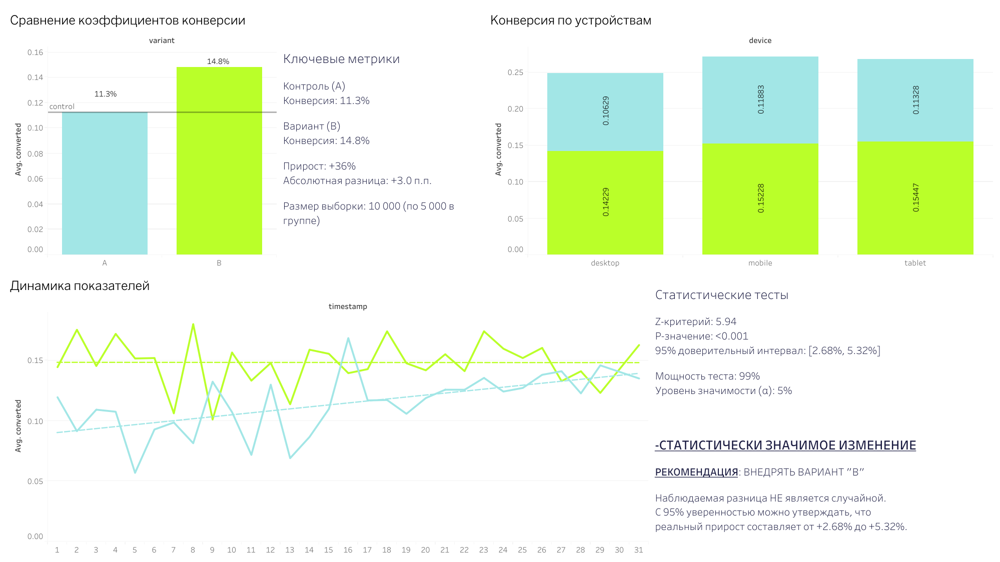

#   A/B Test: Статистический анализ

> Анализ A/B теста с проверкой статистической значимости для оптимизации конверсии

---

##   Что тестировали

**Гипотеза:** Новый дизайн кнопки "Купить" увеличит конверсию

- **Группа A (Control):** Синяя кнопка "Купить"
- **Группа B (Test):** Зелёная кнопка "Купить сейчас со скидкой 10%"
- **Метрика успеха:** Conversion Rate

##  Предпросмотр дашборда

**[→ Открыть интерактивный дашборд в Tableau Public](https://public.tableau.com/views/AB_test_17652866561720/Dashboard1?:language=en-US&:sid=&:redirect=auth&:display_count=n&:origin=viz_share_link)**
---

##   Результаты теста

| Метрика | Группа A | Группа B | Изменение |
|---------|----------|----------|-----------|
| Пользователей | 5,000 | 5,000 | - |
| Конверсий | 563 | 740 | +31% |
| Conversion Rate | 11.26% | 14.8% | +3 п.п. |
| **Uplift** | - | **+31%** | ✅ |

---

##   Статистический анализ

**Z-test для пропорций:**
- **Z-score:** 5.94
- **P-value:** <0.001 (статистически значимо!)
- **95% CI:** [+2.68%, +5.32%]
- **Power:** 99%

**Вывод:** Результат статистически значим (p < 0.05)

---

##   Рекомендация

✅ **ВНЕДРЯТЬ вариант B**

**Обоснование:**
1. Статистически значимое улучшение (p < 0.001)
2. Uplift +31% (+3 п.п. абсолютной конверсии)
3. 95% уверенность: разница от +2.68% до +5.32%

**Ожидаемый эффект:**
При 10,000 посетителей/месяц: +354 покупки/месяц

---

##   Контакты

**Ирина Дмитриева**
- 💼 LinkedIn: [Ваш профиль](https://www.linkedin.com/in/irinadm/)
- 📧 Email: irene.dm.alex@gmail.com
- 📊 Tableau: [Все дашборды](https://public.tableau.com/app/profile/irina.dmitrieva/vizzes)

---

##   Дополнительная информация

- **Использованные инструменты:** SQL, Tableau Public, Google Sheets, BigQuery
- **Демонстрируемые навыки:** Маркетинговая аналитика, Визуализация данных, SQL, Статистический анализ, Бизнес-стратегия
- **Длительность проекта:** 1 неделя
- **Источник данных:** Синтетические данные для демонстрации портфолио
